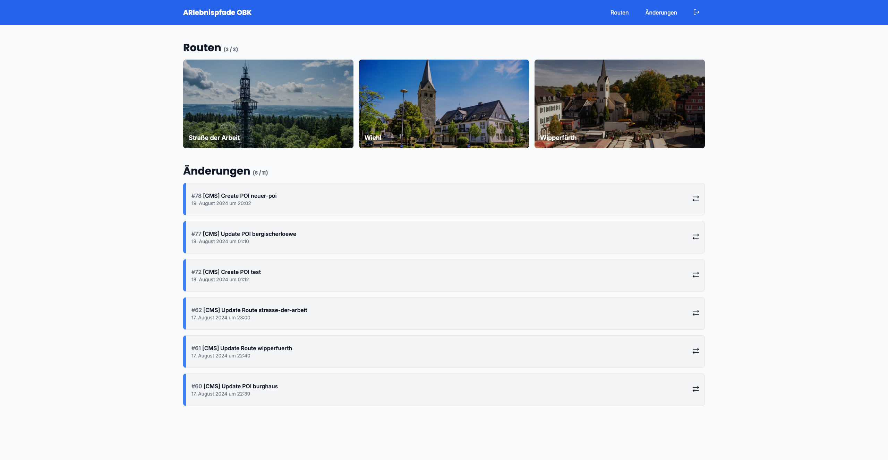
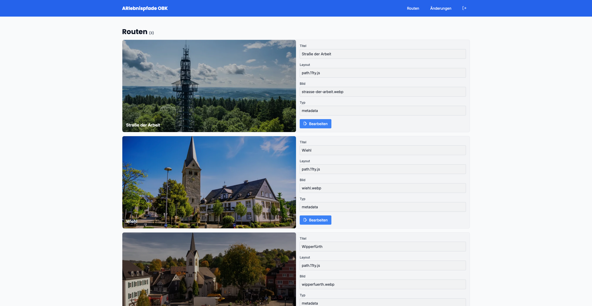
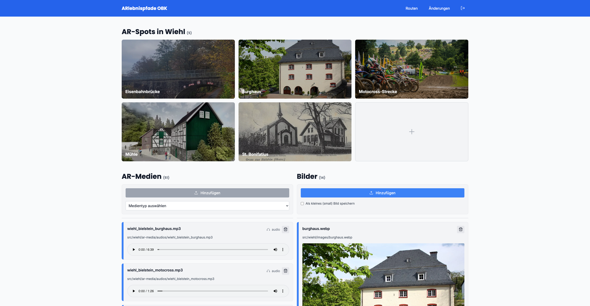
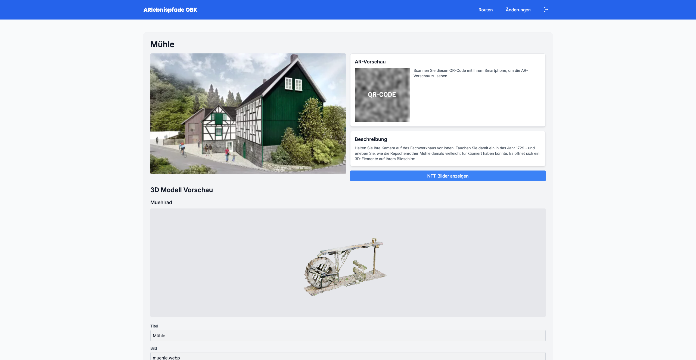
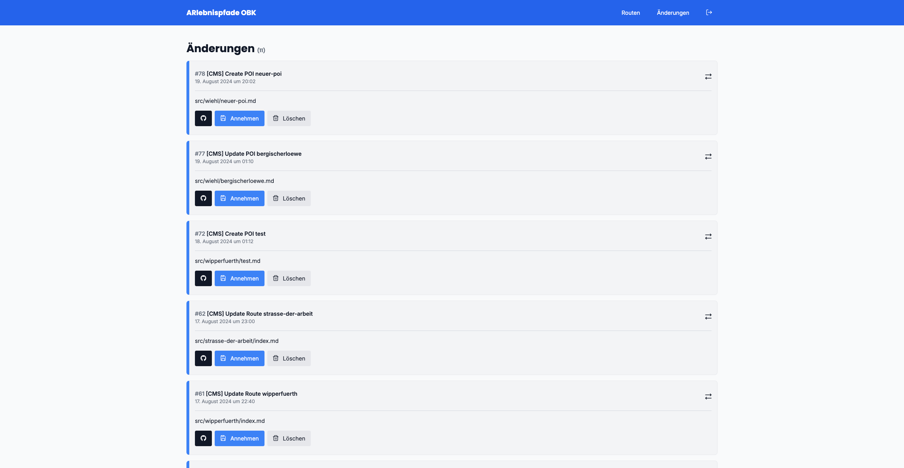

# ARlebnispfade OBK - CMS

Ein Projekt zur redaktionellen Verwaltung von Augmented Reality (AR) Inhalten für das Kooperationsprojekt "ARlebnispfade OBK".

## Überblick

Diese Webanwendung ermöglicht die einfache Integration und Verwaltung von AR-Inhalten wie Texte, Bilder, Audio, Video, 3D-Modelle und Geolocation-Daten. Sie wird im Rahmen einer Bachelorarbeit an der TH Köln entwickelt.



## Struktur

Das Projekt besteht aus zwei Hauptkomponenten:

- `frontend/`: Benutzeroberfläche zur Verwaltung der Routen, POIs, Median und AR-Inhalte
- `backend/`: Server-API zur Datenverwaltung zwischen der Benutzeroberfläche und dem Git-Repository

## Technologien


[](https://github.com/)
[](https://www.docker.com/)


- Frontend: Vue3, Vite, TypeScript
- Backend: Node.js, Express.js, TypeScript

## Installation

Das Projekt kann über Docker Compose gestartet werden. Vorraussetzung ist, dass Docker und Docker Compose auf dem System installiert sind. Außerdem muss ein Access-Token für das ar-lebnispfade Repository auf GitHub erstellt werden.

**Repository klonen**

```bash
git clone git@github.com:antonztsv/arlebnispfade-cms.git
```

**Container über Docker Compose builden und starten**

```bash
docker-compose up -d  --build
```

** Lokalen Admin Nutzer erstellen **

Der

```bash
cd backend
docker compose exec backend npm run create-user
```

## Verwendung

Frontend URL: `http://localhost:5173`

Backend URL: `http://localhost:3000`

## Funktionen

- Verwaltung verschiedener AR-Inhaltstypen
- Vorschau der AR-Inhalte
- Integration mit bestehenden Datenstrukturen des "ARlebnispfade Oberberg" Projekts









## Beitrag

Dieses Projekt ist Teil einer Bachelorarbeit. Beiträge sind daher nicht möglich.

## Kontakt

anton.zaitsev [at] smail.th-koeln.de
